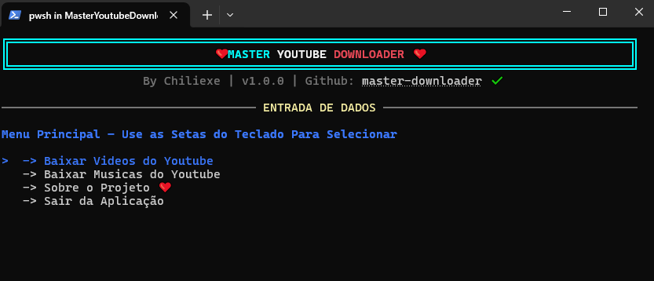
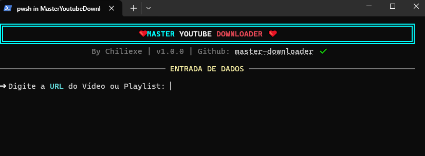
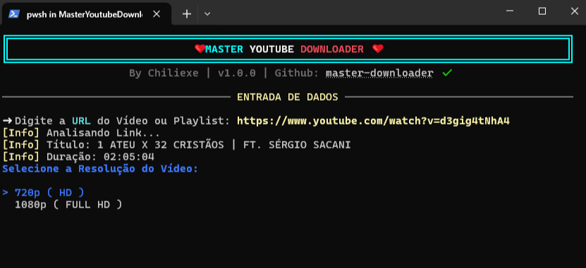
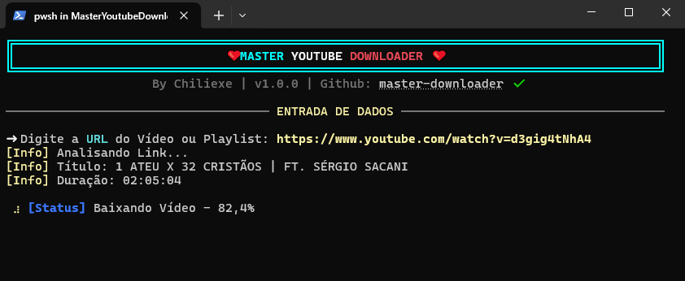

# ❤ Master Youtube Downloader ❤


<p align="center">
  
</p>

## Sobre o Projeto 

O **Master Youtube Downloader** é uma ferramenta de linha de comando (CLI) de alto desempenho, desenvolvida em **C#**. Ele foi projetado para oferecer uma experiência de download de conteúdos do YouTube que seja simples, robusta e visualmente agradável, diretamente do seu terminal.

---

## Download dos Executáveis (Releases)

Escolha a versão compatível com o seu sistema operacional. Não é necessário instalar o .NET SDK para rodar estas versões (Self-Contained).

| Sistema Operacional | Arquitetura | Download |
| :--- | :--- | :--- |
| **Windows** | x64 (64-bit) | [**Baixar .exe**](https://github.com/chiliexe/MasterYoutubeDownloader/releases/latest) |
| **Linux** | x64 (64-bit) | [**Baixar Binário**](https://github.com/chiliexe/MasterYoutubeDownloader/releases/tag/Linux-x64) |
| **macOS** | Intel x64 | [**Baixar Binário**](https://github.com/chiliexe/MasterYoutubeDownloader/releases/tag/MacOS-Intel-x64) |
| **macOS** | Apple Silicon (M1/M2/M3) | [**Baixar Binário**](https://github.com/chiliexe/MasterYoutubeDownloader/releases/tag/MacOS-Arm-x64) |

> **Nota para Linux/Mac:** Após baixar, lembre-se de dar permissão de execução ao arquivo com o comando `chmod +x nome-do-arquivo` no terminal.

---

## Qual a Cara do App?
> 1. Selecione o modo(música ou vídeo)
> 2. Cole o link do Vídeo ou Playlist
> 3. Selecione HD ou FullHD
> 4. Basta Aguardar o Dwonlaod
<p align="center">
  
  
</p>
<p align="center">
  
  
</p>
<p align="center"><em>Interface rica e interativa rodando no terminal.</em></p>

---

## Recursos Principais

* **Inteligência Multiplataforma:** O app detecta automaticamente se você está no Windows, Linux ou macOS e baixa as ferramentas necessárias (yt-dlp e ffmpeg) sem intervenção manual.
* **Gestão de Playlists:** Escolha entre baixar uma playlist completa ou selecionar vídeos específicos de uma lista interativa.
* **Seleção de Resolução:** Suporte nativo para escolher entre **720p (HD)** e **1080p (Full HD)**.
* **Interface Estilizada:** Utiliza a biblioteca `Spectre.Console` para menus, barras de progresso e textos coloridos.

---

## Como Usar (Releases)

A maneira mais fácil de usar é baixando o executável pré-compilado para o seu sistema operacional na seção de **Releases** do repositório.

1.  Vá em **[Releases](https://github.com/chiliexe/MasterYoutubeDownloader/releases)**.
2.  Baixe o arquivo correspondente ao seu SO (ex: `MasterYoutubeDownloader_win-x64.zip`).
3.  Extraia e rode o executável (`.exe` no Windows).

---

### O Que o App Usa de Background

O **Master Youtube Downloader** utiliza o que há de melhor no ecossistema de manipulação de mídia e interfaces de terminal para garantir rapidez e estabilidade.

#### **Core Engine**
* **[yt-dlp](https://github.com/yt-dlp/yt-dlp):** O motor principal de download. É uma bifurcação (fork) do `youtube-dl` focada em velocidade e suporte constante a novas atualizações do YouTube.
* **[FFmpeg](https://ffmpeg.org/):** A ferramenta definitiva para processamento de áudio e vídeo. No projeto, o FFmpeg é responsável por realizar o *merge* (junção) das trilhas de vídeo e áudio de alta qualidade.

#### **Bibliotecas .NET**
* **[Spectre.Console](https://spectreconsole.net/):** Responsável por toda a interface visual rica no terminal, incluindo menus interativos, tabelas e as barras de progresso dinâmicas.
* **[YoutubeExplode](https://github.com/Tyrrrz/YoutubeExplode):** Utilizada para a extração eficiente de metadados, títulos e resoluções das URLs fornecidas.

---

## ⚙ Instalação via Código Fonte

Se preferir compilar você mesmo, certifique-se de ter o **SDK do .NET 8.0** instalado.

```bash
# Clone o repositório
git clone https://github.com/chiliexe/MasterYoutubeDownloader.git

# Entre na pasta do projeto
cd MasterYoutubeDownloader/MasterYoutubeDownloader.App

# Publique o executável (exemplo para Windows)
dotnet publish -c Release -r win-x64 --self-contained true /p:PublishSingleFile=true /p:PublishTrimmed=true
```


## ⚖ Aviso Legal (Disclaimer)
Este software foi desenvolvido estritamente para fins educacionais e de pesquisa pessoal. O desenvolvedor não se responsabiliza pelo uso indevido desta ferramenta para baixar conteúdo protegido por direitos autorais sem a autorização do detentor. Ao usar este software, você concorda em respeitar os termos de serviço do YouTube e as leis de direitos autorais do seu país.

## 📜 Licença
Este projeto está licenciado sob a MIT License - consulte o arquivo LICENSE para detalhes. Você é livre para usar, modificar e distribuir este software, desde que mantenha os créditos originais.

```html
<p align="center">Desenvolvido com ❤ por <a href="https://www.google.com/search?q=https://github.com/chiliexe">Chiliexe</a></p>
```


